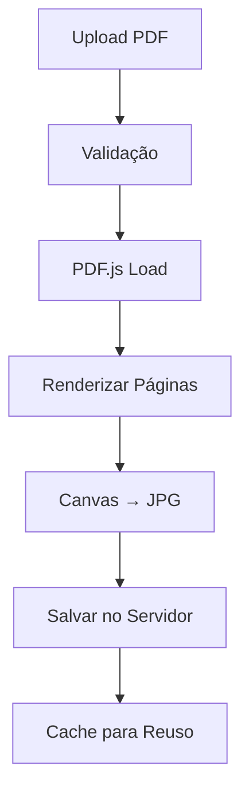

# 📄 Sistema PAPEM Digital

Sistema de visualização digital para a **Pagadoria de Pessoal da Marinha (PAPEM)**, desenvolvido para exibir documentos, escalas de serviço e avisos importantes em telas de forma automatizada.

## ⚓ Sobre o Projeto

O sistema permite a visualização contínua e alternada de:
- **PLASA** (Planos de Serviço) - Rolagem automática
- **BONO** (Boletins de Ocorrências) - Rolagem automática  
- **Escalas de Serviço** (Oficiais/Praças) - Alternância automática
- **Cardápios Semanais** - Alternância automática
- **Avisos Importantes** - Sistema de notificações

## 🏗️ Arquitetura

### Frontend (React + TypeScript)
- **Framework:** React 18 com TypeScript
- **Estilização:** Tailwind CSS + shadcn/ui
- **Roteamento:** React Router
- **Estado:** Context API personalizado
- **Build:** Vite

### Backend (Node.js + Express)
- **Runtime:** Node.js
- **Framework:** Express.js
- **Upload:** Multer para arquivos
- **CORS:** Configuração completa
- **Conversão PDF:** PDF.js (client-side)

### Estrutura de Pastas
```
papem-digital/
├── src/                    # Frontend React
│   ├── components/         # Componentes UI
│   ├── context/           # Context API (DisplayContext)
│   ├── pages/             # Páginas (Display, Admin)
│   └── hooks/             # Hooks customizados
├── server.js              # Backend Express
├── public/                # Arquivos estáticos
│   ├── uploads/           # Documentos enviados
│   ├── plasa-pages/       # Páginas PLASA convertidas
│   ├── escala-images/     # Cache escalas
│   └── cardapio-images/   # Cache cardápios
└── data/                  # Dados persistidos
    ├── notices.json       # Avisos salvos
    └── config.json        # Configurações
```

## 🚀 Como Executar

### Pré-requisitos
- Node.js 18+ 
- npm ou yarn

### Instalação
```bash
# Clonar repositório
git clone [url-do-repo]
cd papem-digital

# Instalar dependências
npm install

# Executar backend
node server.js

# Executar frontend (em outro terminal)
npm run dev
```

### URLs
- **Frontend:** http://localhost:5173
- **Backend:** http://localhost:3001
- **Admin:** http://localhost:5173/admin

## 📋 Funcionalidades

### 🖥️ Tela de Visualização
- **Lado Esquerdo:** PLASA/BONO com rolagem contínua
- **Lado Direito:** Escalas/Cardápios com alternância automática
- **Rodapé:** Avisos importantes com rotação
- **Responsivo:** Adapta-se a diferentes tamanhos de tela

### ⚙️ Painel Administrativo
- **Upload de Documentos:** PDF e imagens
- **Conversão Automática:** PDF → Imagem para compatibilidade
- **Gerenciamento de Avisos:** CRUD completo com servidor
- **Configurações:** Velocidade, intervalos, comportamentos
- **Cache Inteligente:** Evita reprocessamento desnecessário

### 🔄 Automação
- **PLASA/BONO:** Rolagem vertical contínua
- **Escalas:** Alternância entre Oficiais/Praças
- **Cardápios:** Rotação automática
- **Avisos:** Sistema de prioridades e validade

## 🎯 Tipos de Documento

| Tipo | Comportamento | Localização | Descrição |
|------|---------------|-------------|-----------|
| 📄 **PLASA** | Rolagem | Lado Esquerdo | Plano de Serviço |
| 📋 **BONO** | Rolagem | Lado Esquerdo | Boletim de Ocorrências |
| 📊 **Escala** | Alternância | Lado Direito | Escalas Oficiais/Praças |
| 🍽️ **Cardápio** | Alternância | Lado Direito | Cardápios Semanais |

## 🔧 Configurações

### Velocidade de Rolagem
- **Lenta:** 1px por frame
- **Normal:** 3px por frame  
- **Rápida:** 5px por frame

### Intervalos
- **Alternância:** 10-300 segundos (padrão: 30s)
- **Reinício:** 2-10 segundos (padrão: 3s)

### Cache
- **PLASA:** `/plasa-pages/` (imagens convertidas)
- **Escalas:** `/escala-images/` (cache por documento)
- **Cardápios:** `/cardapio-images/` (cache por documento)

## 📡 API Endpoints

### Documentos
```
POST /api/upload-pdf          # Upload documento
GET  /api/list-pdfs           # Listar documentos
DELETE /api/delete-pdf/:id    # Deletar documento
```

### Páginas PLASA
```
POST /api/upload-plasa-page   # Salvar página convertida
POST /api/check-plasa-pages   # Verificar páginas existentes
DELETE /api/clear-plasa-pages # Limpar cache
```

### Cache Escalas/Cardápios
```
POST /api/upload-escala-image    # Cache escala
GET  /api/check-escala-image/:id # Verificar cache escala
POST /api/upload-cardapio-image  # Cache cardápio
GET  /api/check-cardapio-image/:id # Verificar cache cardápio
```

### Avisos
```
GET    /api/notices           # Listar avisos
POST   /api/notices           # Criar aviso
PUT    /api/notices/:id       # Atualizar aviso
DELETE /api/notices/:id       # Deletar aviso
```

### Sistema
```
GET /api/status               # Status do servidor
GET /api/system-info          # Informações detalhadas
```

## 🛠️ Tecnologias Utilizadas

### Frontend
- React 18 + TypeScript
- Tailwind CSS
- shadcn/ui components
- React Router DOM
- PDF.js (conversão client-side)
- Context API

### Backend  
- Node.js + Express
- Multer (upload arquivos)
- CORS (cross-origin)
- File System (persistência)

## 📊 Fluxo de Conversão



## 🔍 Debug e Monitoramento

### URLs de Debug
- `/api/status` - Status geral
- `/api/system-info` - Informações detalhadas
- Console do navegador (F12) - Logs detalhados

### Logs Importantes
```javascript
📄 PLASA: Conversão iniciada
💾 Cache encontrado
🔄 Alternância entre escalas
📢 Aviso carregado do servidor
```

## 🚦 Estados do Sistema

- **🟢 Online:** Sistema funcionando normalmente
- **🟡 Cache:** Usando versões em cache
- **🔴 Erro:** Problemas na conversão/carregamento
- **⏸️ Pausado:** Automação pausada pelo usuário

## 📝 Notas de Desenvolvimento

### Conversão PDF
- PDFs são convertidos para imagens JPG (qualidade 85%)
- Cache inteligente evita reconversão
- Fallback para dataURL se servidor falhar

### CORS
- Configuração completa para cross-origin
- Headers manuais para compatibilidade
- Suporte a blob URLs e data URLs

### Persistência
- Avisos salvos em `data/notices.json`
- Documentos persistem no localStorage + servidor
- Cache de imagens no servidor

---

**Desenvolvido para a Marinha do Brasil - PAPEM**  
*"Ordem, Prontidão e Regularidade"* ⚓
